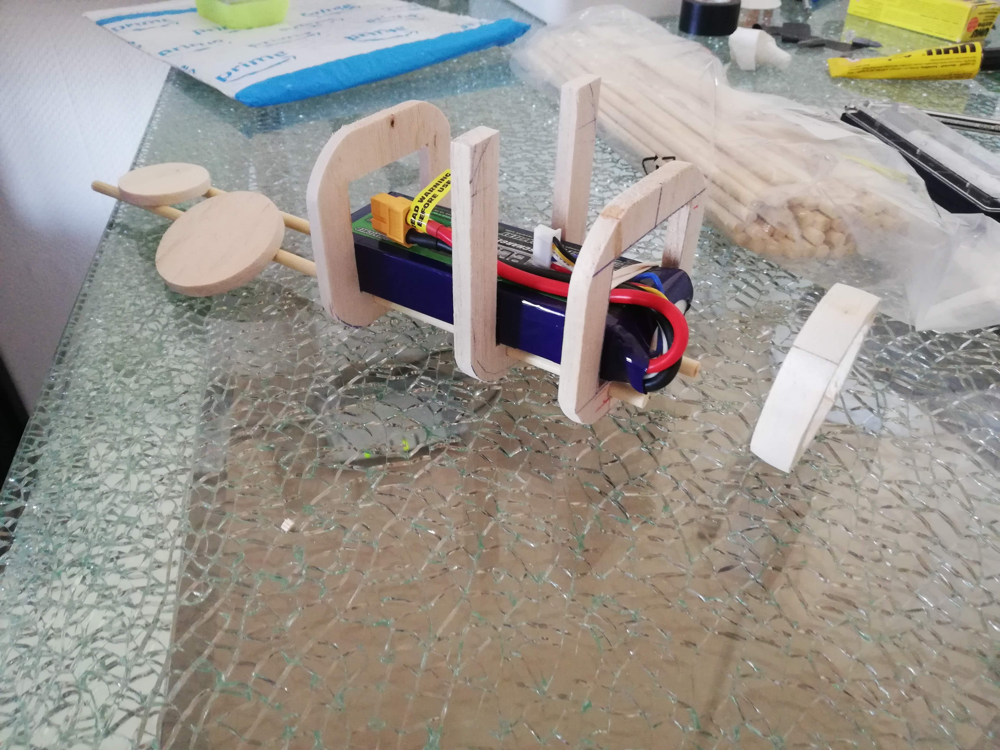
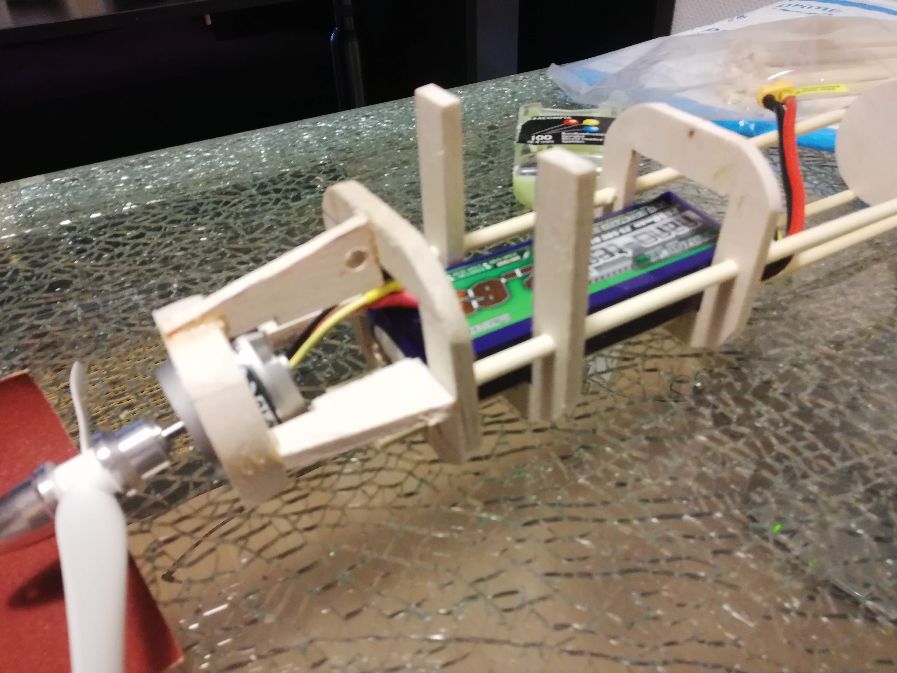
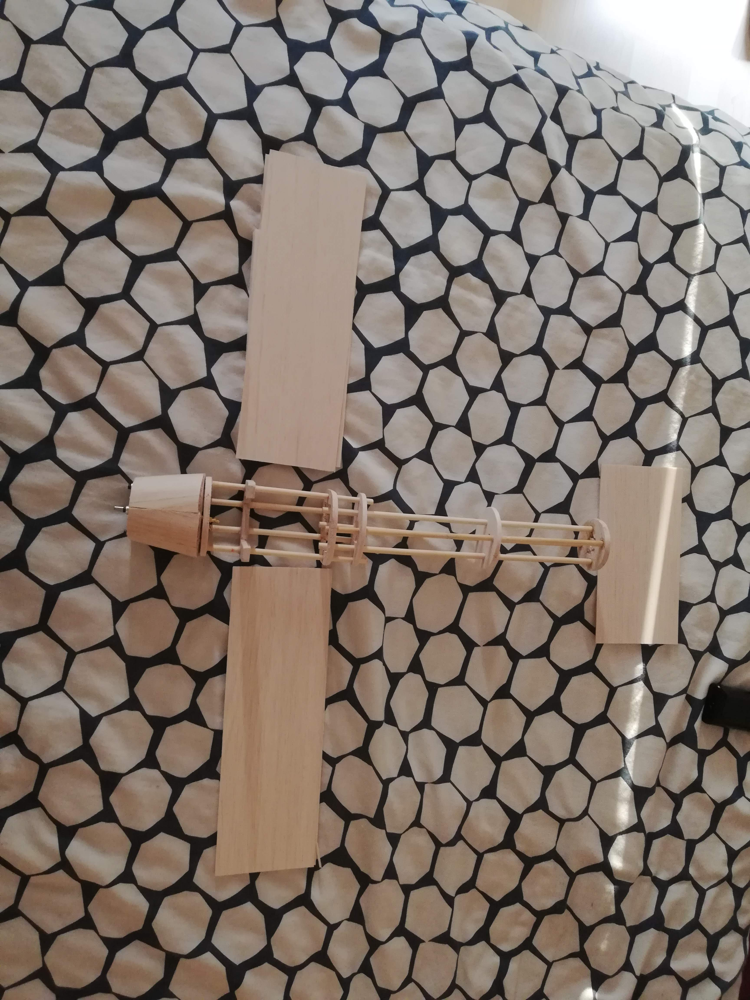
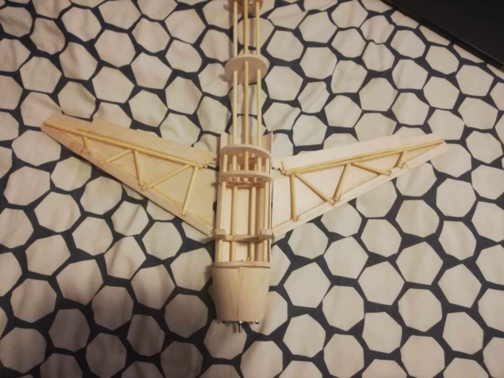
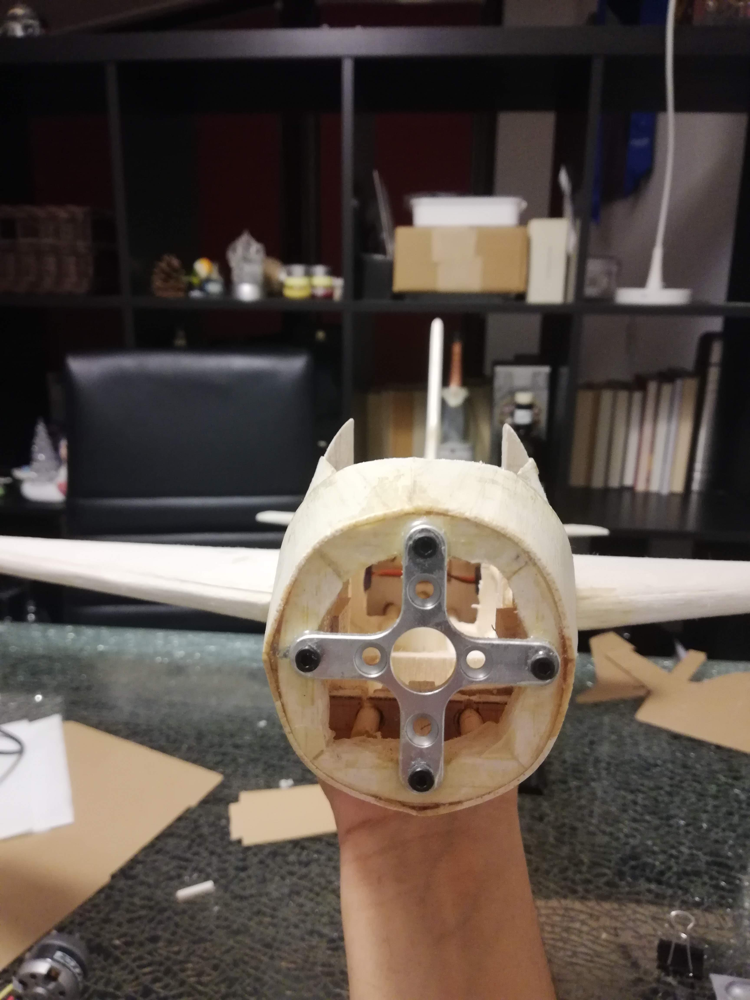
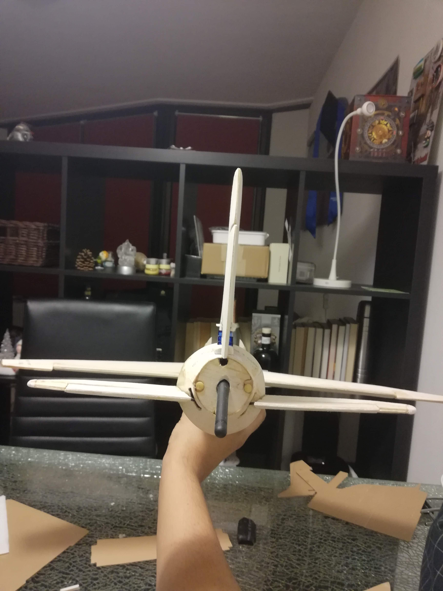
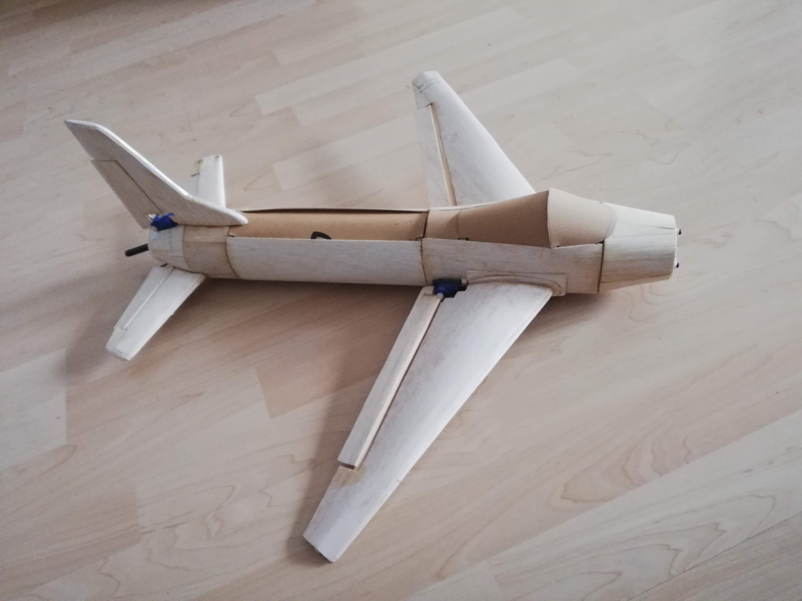

I started this project as a way to elevate my programming skills. Since the inception, the projec has evolved to include two microcontroller (NodeMCU & Teensy4.1), an Android app (Remote Controller), two Inertial Measurement Units, Radio and WiFi connection using WebSockets and several servos motors and a BLDC motor. 

In this Jupyter Notebook, I wish to document all the components used in the project as well as libraries, pinning diagrams, Pinout diagrams, technical details about the implementation and other such information that is relevant to the project. 

Other important function of this Jupyter Notebook is to use the Plotly library to display the planes flight data based on the data collected by the IMUs for analysis. In two different ways, I have been able to simulate the planes roll, pitch and yaw motions in a 3d graph. However, there is a lot more work required before I can realize what I have in mind. 

I have uploaded the code that I have soo far in these repositories: 
1. [Remote-Controller App](https://github.com/SParishwad/Remote-Controller.git)
2. [NodeMCU Master](https://github.com/SParishwad/NodeMCU-Master.git)
3. [Teensy4.1 Slave](https://github.com/SParishwad/Teensy4.1-Slave.git)
4. [Teensy4.1 - IMU](https://github.com/SParishwad/Teensy4.1-10DOF_IMU.git)

Any inputs on any part of the project is appreciated. 

  
   
  
  
  
  
  

 
 

